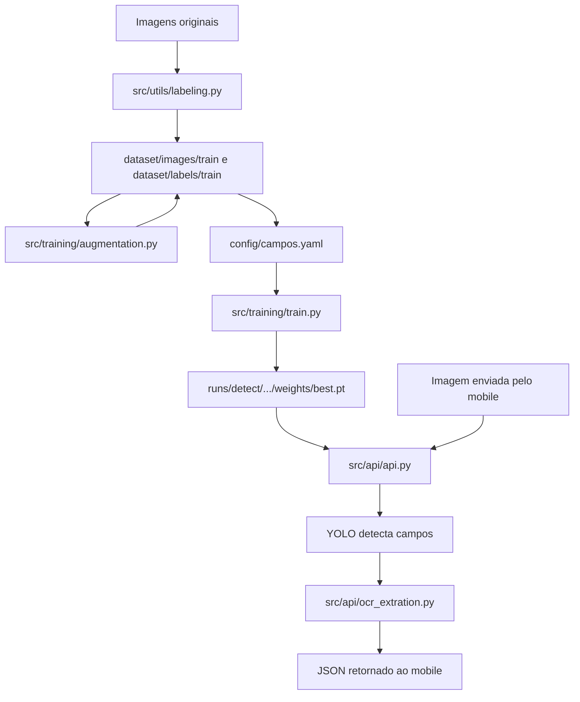

# Arquitetura atual do MedTrack-IA

Este documento registra a estrutura atual do modulo de IA do projeto MedTrack. A ideia e deixar claro como o projeto esta organizado hoje antes de iniciar cleanup, refatoracao e documentacao operacional.

## Contexto do modulo

O MedTrack-IA e o modulo responsavel por detectar campos em imagens de medicamentos e extrair textos desses campos. Ele faz parte de um projeto maior da universidade, no qual o aplicativo mobile deve consumir uma rota de API para enviar uma imagem e receber os dados extraidos.

No estado atual, o projeto combina tres responsabilidades principais:

- Preparacao de dados: rotulagem manual e aumento de dados.
- Treinamento de modelo: treino de YOLOv8 para detectar campos em embalagens de medicamentos.
- Servico de inferencia: API FastAPI que recebe uma imagem, roda deteccao com YOLO e OCR com EasyOCR.

## Estrutura de diretorios

```text
MedTrack-IA/
|-- config/
|   `-- campos.yaml
|-- dataset/
|-- docs/
|-- src/
|   |-- api/
|   |   |-- api.py
|   |   |-- main.py
|   |   `-- ocr_extration.py
|   |-- training/
|   |   |-- augmentation.py
|   |   `-- train.py
|   `-- utils/
|       `-- labeling.py
|-- README.md
|-- requirements.txt
`-- .gitignore
```

## Componentes

### `src/api/api.py`

Arquivo principal da API. Ele:

- seleciona CPU ou GPU com base na disponibilidade do PyTorch;
- monta um caminho local para o arquivo `best.pt`;
- carrega o modelo YOLOv8;
- cria a aplicacao FastAPI;
- expoe a rota `POST /detect`;
- recebe uma imagem via upload;
- redimensiona imagens grandes para no maximo 1024 pixels na maior dimensao;
- executa deteccao com YOLO;
- identifica se existe a classe `generico`;
- recorta cada campo detectado;
- chama o OCR para extrair texto dos recortes;
- retorna um JSON com `status`, `is_generico`, `data` e `count`.

Contrato atual da rota:

```json
{
  "status": "success",
  "is_generico": false,
  "data": {
    "nome": "Texto extraido",
    "dosagem": "Texto extraido"
  },
  "count": 2
}
```

Ponto importante: a API depende da existencia local do arquivo de modelo em um caminho especifico dentro de `src/training/runs/.../weights/best.pt`. Se esse arquivo nao existir, o processo encerra antes de subir o servidor.

### `src/api/ocr_extration.py`

Modulo responsavel pelo OCR. Ele:

- inicializa um leitor EasyOCR global com idiomas `en` e `pt`;
- recorta uma regiao da imagem com base nas coordenadas recebidas;
- aplica OCR no recorte;
- concatena os textos detectados;
- normaliza espacos em branco.

O OCR hoje e acoplado diretamente ao EasyOCR, e o parametro `gpu=True` esta fixo na inicializacao do leitor.

### `src/api/main.py`

Script de teste/manual para carregar um modelo YOLO e executar predicao em uma imagem local. Ele tambem exibe o resultado com OpenCV.

Este arquivo nao parece ser o ponto de entrada real da API. Atualmente ele mistura:

- carregamento de modelo base;
- carregamento de modelo treinado por caminho absoluto/relativo;
- caminho de imagem local;
- visualizacao em janela com OpenCV.

### `src/training/train.py`

Script de treinamento. Ele:

- escolhe `cuda` ou `cpu`, mas passa `device=0` no treino;
- usa `config/campos.yaml` como configuracao do dataset;
- inicia a partir do modelo base `yolov8n.pt`;
- treina por 100 epocas;
- salva resultados em `runs/detect`;
- nomeia o experimento como `medtrack_yolo_train`.

O resultado esperado do treino e um arquivo `weights/best.pt`, que depois precisa estar disponivel para a API.

### `src/training/augmentation.py`

Script de aumento de dados. Ele le imagens e labels de treino, aplica transformacoes e salva novas imagens e labels no mesmo conjunto de treino.

Transformacoes atuais:

- brilho e contraste;
- ruido;
- blur leve;
- sombra simulada;
- rotacao leve com ajuste de bounding boxes;
- flip horizontal com ajuste de bounding boxes.

O script executa trabalho diretamente no import/execucao do arquivo, usando caminhos relativos fixos para `dataset/images/train` e `dataset/labels/train`.

### `src/utils/labeling.py`

Ferramenta manual de rotulagem com OpenCV. Ela:

- abre imagens de diretorios definidos no proprio arquivo;
- permite desenhar bounding boxes;
- alterna classes por teclas `1` a `6`;
- salva labels no formato YOLO;
- copia imagens rotuladas para `dataset/images/train`.

Classes usadas na rotulagem:

```text
0 nome
1 agente_ativo
2 dosagem
3 validade
4 quantidade
5 generico
```

### `config/campos.yaml`

Arquivo de configuracao do YOLO para treino. Ele define:

- caminho base do dataset: `../dataset`;
- subconjunto de treino: `images/train`;
- subconjunto de validacao: `images/val`;
- nomes das classes.

Este arquivo e essencial para o treinamento, pois conecta o script `train.py` ao dataset e define a ordem das classes usada pelo modelo.

## Fluxo atual



## Dependencias principais

As dependencias declaradas em `requirements.txt` cobrem:

- FastAPI e Uvicorn para a API;
- Ultralytics/YOLOv8 para deteccao;
- EasyOCR para OCR;
- OpenCV e NumPy para processamento de imagem;
- python-dotenv para variaveis de ambiente;
- Pydantic para validacao.

Ha tambem uso direto de `torch` nos scripts, mas `torch` nao aparece explicitamente no `requirements.txt`.

## Pontos de atencao arquiteturais

- A API, o treino, a rotulagem e o aumento de dados estao no mesmo repositorio, mas ainda sem uma separacao clara entre codigo de biblioteca, scripts executaveis e configuracao.
- Caminhos de arquivos e diretorios estao embutidos nos scripts, o que dificulta execucao por outros integrantes.
- O arquivo do melhor modelo (`best.pt`) nao esta versionado e tambem nao ha uma estrategia documentada para obte-lo.
- O dataset tambem nao tem estrategia documentada de distribuicao ou reproducao.
- `config/campos.yaml` e central para o treinamento, mas seu papel ainda nao esta explicado no README.
- A rota da API depende do artefato de treinamento existir localmente antes da aplicacao subir.
